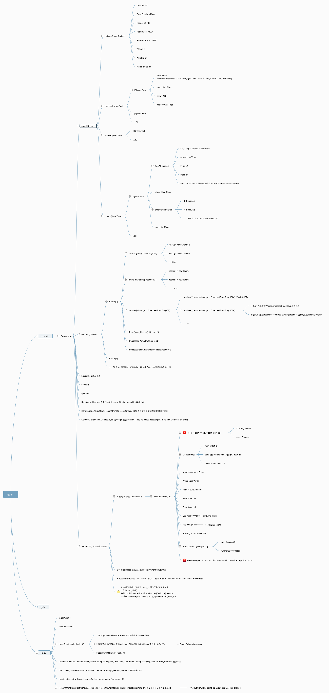

# goim-demo
一个 goim 的demo 改服务发现为etcd 改 kafka 为 redis 

## 特性 
 * 高性能
 * 纯Golang实现
 * 支持单个用户拥有多个设备
 * 支持推送至指定设备(该设备可以订阅多房间)
 * 支持广播推送至所有指定房间
 * 心跳支持（应用心跳和tcp、keepalive）
 * 支持安全验证（未授权用户不能订阅）
 * 多协议支持（websocket，tcp）
 * 可拓扑的架构（comet、job、logic模块可动态无限扩展）
 * 支持redis、kafka两种消息中间件切换 (目前可通过配置文件中consume.kafkaEnable、consume.redisEnable设置)


## 更改介绍

### 服务发现
- 改用etcd 
- 服务注册 规则按 /环境/服务名/地区/节点编号
- 服务发现 规则按 /环境/服务名/地区 (即 每个地区可以发现n个节点)

### kafka 改redis
- 目前demo代码支持redis/kafka 做中间件
- 移除已经弃用的库 github.com/bsm/sarama-cluster 

## 部署
- 方案一 选择redis作为消息中间件切换, 仅需要 redis etcd 即可;
- 方案二 选择kafka作为消息中间件切换, 需要 redis kafka etcd 即可;
```sh 
$ git clone git@github.com:poembro/goim-demo.git
$ cd goim-demo
$ go mod tidy
$ make build
$ make runjob     ##运行 job 服务
$ make runlogic   ##运行 logic 服务
$ make runcomet   ##运行 comet 服务

$ go run tcp_client_testing.go 9999 100 192.168.84.168:3101   ## 运行100个并发测试脚本   
$ cd examples/javascript/ && go run main.go   ## 运行http静态页面 
$ curl "http://127.0.0.1:3111/goim/push/all?operation=1000&speed=0" -sv     ## 推送消息

```


### 注意点
```
问题一 : 房间号如果是 用户id  (目前采用该方式,缺点在可接受范围)

1. 房间号太多 分散到redis 64个hset类型key, 每个key的value值有个 room_count 会非常大  
 comet服务会上报房间号写入 redis "HSET" "ol_192.168.3.222" "43" "{\"server\":\"192.168.3.222\",\"room_count\":{\"live://1000\":1},\"updated\":1577077540}" 
2.单个节点如果有 10000人在线 则1个key的value值中json room_count的长度为  1w / 64 = 156 个房间 
3.房间下线 room_count 会对应 减少


问题二 : 多台机器部署 kafka 的 group id 需要一致 
1.所有消费者都在"一个消费者组"里则是 队列模式  
2.所有消费者分布在"不同组"中则是 发布-订阅模式。

1.1 队列模式下，允许消费者组中多个消费者并行有序处理消息，组中的消费者数量最好不要大于 topic 的 partition（分区）数量。 
消费者数=分区数:每个消费者消费一个分区的消息； 
消费者数<分区数:某些消费者会处理多个分区的消息； 
消费者数>分区数:多余的消费者将空等，无法处理消息；

注意 查看kafka 代理版本   代码中 为 sarama.V2_8_1_0 与 kafka 代理版本对应
# docker exec -it 0a005e376003 bash
root@0a005e376003:/# find / -name \*kafka_\* | head -1 | grep -o '\kafka[^\n]*'
kafka_2.13-2.8.1    


问题三: 目前job消费端采用 hash key分区消息(即:hash房间号/operation:8000 让job消费节点发生rebalance 负载均衡,但前提是topic的Partitions数大于1才能触发)
I0530 14:21:33.521813 1499866 sub_kafka.go:59] consume: goim-push-topic/Partition: 1/Offset: 1648	1000	type:BROADCAST operation:1000 msg:"111" 
  
I0530 14:35:11.114918 1499866 push.go:90] broadcast comets:1
I0530 14:35:11.114999 1499866 sub_kafka.go:59] consume: goim-push-topic/Partition: 0/Offset: 0	1001	type:BROADCAST operation:1001 msg:"2222" 

参考: https://zhuanlan.zhihu.com/p/412869212


问题四: 不同包路径下的 同名 api.proto 报错提示已经引入

luoyuxiangdeMacBook-Pro:goim-demo luoyuxiang$ make runjob
export GODEBUG=http2debug=2 && export GOLANG_PROTOBUF_REGISTRATION_CONFLICT=warn && ./target/job -conf=target/job.toml -region=sh -zone=sh001 -deploy.env=prod -host=192.168.84.168 -log_dir=./target 
WARNING: proto: file "api.proto" is already registered
See https://developers.google.com/protocol-buffers/docs/reference/go/faq#namespace-conflict


解决
https://stackoverflow.com/questions/67693170/proto-file-is-already-registered-with-different-packages
 
方案 一:  go.mod 中 使用指定protobuf包版本
google.golang.org/protobuf v1.26.1-0.20210525005349-febffdd88e85 // indirect

方案二: 
编译后 启动时加参数 
export GODEBUG=http2debug=2 && export GOLANG_PROTOBUF_REGISTRATION_CONFLICT=warn && ./target/job


```


### 文档
```

#### 推送至user_id它订阅的房间
> POST /goim/push/mids?operation=1001&mids=123 HTTP/1.1
> Host: 127.0.0.1:3111
> User-Agent: insomnia/2021.6.0-alpha.7
> Accept: */*
> Content-Length: 34

22222222222222

* upload completely sent off: 34 out of 34 bytes
* Mark bundle as not supporting multiuse

< HTTP/1.1 200 OK
< Content-Type: application/json; charset=utf-8
< Date: Tue, 17 May 2022 06:51:47 GMT
< Content-Length: 23


#### 推送至device_id它订阅的房间
> POST /goim/push/keys?operation=1001&keys=123456123 HTTP/1.1
> Host: 127.0.0.1:3111
> User-Agent: insomnia/2021.6.0-alpha.7
> Accept: */*
> Content-Length: 23

| 11111111111111111111111

* upload completely sent off: 23 out of 23 bytes
* Mark bundle as not supporting multiuse

< HTTP/1.1 200 OK
< Content-Type: application/json; charset=utf-8
< Date: Tue, 17 May 2022 06:52:22 GMT
< Content-Length: 23


#### 推送至room_id它订阅的房间

> POST /goim/push/room?operation=1001&type=live&room=1000 HTTP/1.1
> Host: 127.0.0.1:3111
> User-Agent: insomnia/2021.6.0-alpha.7
> Accept: */*
> Content-Length: 37

| 333333333333333333333

* upload completely sent off: 37 out of 37 bytes
* Mark bundle as not supporting multiuse

< HTTP/1.1 200 OK
< Content-Type: application/json; charset=utf-8
< Date: Tue, 17 May 2022 06:52:55 GMT
< Content-Length: 23


#### 推送至订阅的房间
> POST /goim/push/all?operation=1001&speed=1 HTTP/1.1
> Host: 127.0.0.1:3111
> User-Agent: insomnia/2021.6.0-alpha.7
> Accept: */*
> Content-Length: 22

|  1116666

* upload completely sent off: 22 out of 22 bytes
* Mark bundle as not supporting multiuse

< HTTP/1.1 200 OK
< Content-Type: application/json; charset=utf-8
< Date: Tue, 17 May 2022 06:54:27 GMT
< Content-Length: 23


#### 统计多少房间多少人
> GET /goim/online/top?type=live&limit=10 HTTP/1.1
> Host: 127.0.0.1:3111
> User-Agent: insomnia/2021.6.0-alpha.7
> Accept: */*
> Content-Length: 12

| 7777777777777777777

* upload completely sent off: 12 out of 12 bytes
* Mark bundle as not supporting multiuse

< HTTP/1.1 200 OK
< Content-Type: application/json; charset=utf-8
< Date: Tue, 17 May 2022 06:55:09 GMT
< Content-Length: 33
.


#### 某单个房间多少人 
> GET /goim/online/room?type=live&rooms=1000 HTTP/1.1
> Host: 127.0.0.1:3111
> User-Agent: insomnia/2021.6.0-alpha.7
> Accept: */*
> Content-Length: 12

| 8888888888888888

* upload completely sent off: 12 out of 12 bytes
* Mark bundle as not supporting multiuse

< HTTP/1.1 200 OK
< Content-Type: application/json; charset=utf-8
< Date: Tue, 17 May 2022 06:55:49 GMT
< Content-Length: 41

```


## 看源码过程中 各个结构图
[](https://github.com/poembro/goim-demo)

